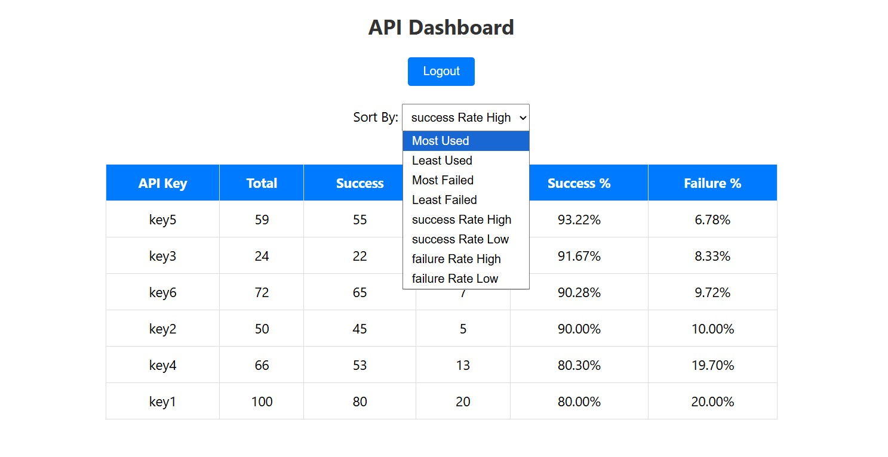

## Excel Data Fetch

## using Spring-boot

This project is to extract the API data from an excel file and put in an ordered manner using **springboot**.

I have used imports and dependencies like "**Apache POI**" to get the data from the excel format to json format.

The project features the use of **two-factor authentication** using an **Email based OTP system**.

uses **Bcrypt** to hash passwords to store securely.

Files stay secure since they are never stored in the database, this helps keep user **privacy**.

All the excel files need to be in this format

|API Key|Total Calls|Success Calls|Failed Calls|
|-|-|-|-|
|key1|50|45|5|
|key2|32|28|4|
|key3|72|65|7|

When the script runs it skips the first row when extracting the data 

String apiKey = row.getCell(0).getStringCellValue();

&#x20;               int total = (int) row.getCell(1).getNumericCellValue();

&#x20;               int success = (int) row.getCell(2).getNumericCellValue();

&#x20;               int failed = (int) row.getCell(3).getNumericCellValue();

it gets the api names from the first row and the numeric values from the row two and three.

###### Passwords:

Please use your own passwords and mail.

files which need user input passwords/mail/keys:

application.properties

EmailService.java

use your own database name and password, use a MySQL database, create a u don't need to create a table the program will do it own it's own.

for the email in Emailservice and application.properites use any gmail account with two factor auth. 

For the key, go to the same gmail account, app passwords, and create an app on gmail, enter the key for that app there.

